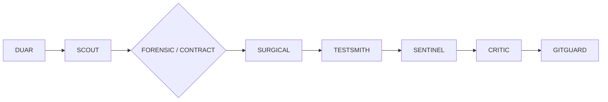

# AGENTIC

**A battle-tested skill pack and portable design-system exports for AI-driven coding.**

Built for vibe coding: less back-and-forth, more shipped code. Every skill here exists to make an AI agent execute like a senior engineer — recon before patching, surgical diffs, regression guards, and zero scope creep.

   

---

## What's Inside

```
agentic/
├── skills/     # DUAR Vibe Coding Skill Pack — 12 composable agent skills
└── design/     # Portable design-system exports (tokens as spec) — hcpanel + cursor
```

## Part 1 — The DUAR Skill Pack

A modular skill pack for request-efficient, tool-driven AI coding workflows. Each skill is a single `SKILL.md` with frontmatter (`name`, `description`) that drops straight into any skill-capable agent runtime.

| Skill | Role | What It Does |
|---|---|---|
| `duar` | Executor | Do Until All Resolved — batch subtasks, run the full loop, minimize request overhead |
| `scout` | Recon | Map architecture, entry points, dependencies, and conventions before touching anything |
| `forensic` | Debugger | Root-cause via the actual execution path — never patch symptoms |
| `contract` | Guardian | Identify and preserve behavioral contracts, interfaces, and side effects |
| `surgical` | Implementer | Minimal, targeted patches that respect architecture and unrelated functionality |
| `testsmith` | Validator | Derive and run practical validation; diagnose failures and rerun after fixes |
| `sentinel` | Regression Guard | Compare before/after behavior; catch unintended side effects |
| `critic` | Adversary | Final review that actively hunts wrong assumptions, edge cases, hidden failure modes |
| `scope` | Discipline | Separate requested work from required support, optional polish, and unrelated noise |
| `context` | Memory | Structured project state so future sessions skip re-processing history |
| `handoff` | Continuity | Compact, high-fidelity state transfer across sessions or context windows |
| `gitguard` | Last Line | Audit the final diff for accidental edits, generated noise, and scope violations |

### Execution Pipeline

Skills are designed to chain. The recommended flow:



- **CONTEXT** and **HANDOFF** provide continuity across sessions.
- **SCOPE** stays active throughout the entire workflow.

### Installation

Copy any skill folder into your agent's skill directory:

```bash
# e.g. for Kilo / Claude-style runtimes
cp -r skills/<skill-name> ~/.agents/skills/

# or project-scoped
cp -r skills/<skill-name> .kilo/agent/
```

Each skill is standalone — adopt the full pipeline or cherry-pick what your workflow needs.

## Part 2 — Design System Exports

The `design/` directory holds framework-agnostic design-system specs, each exported as a single declarative `DESIGN.MD`:

- **Colors** — complete palettes: canvas/surface layers, ink scales, hairlines, semantic states, dark mode where applicable
- **Typography** — full type ramp with family, size, weight, line-height, and letter-spacing per role
- **Tokens & components** — spacing, radius, layout, motion, and ready-to-use component recipes referenced by token

Point your AI builder at a `DESIGN.MD` and it implements UI that matches the system instead of inventing its own. Current exports:

| Export | System | Character |
|---|---|---|
| [`design/hcpanel/DESIGN.MD`](design/hcpanel/DESIGN.MD) | HC Panel v1.0 | Control-panel aesthetic — cool near-white canvas, single brand blue, monochromatic charts, light + dark modes |
| [`design/cursor/DESIGN.MD`](design/cursor/DESIGN.MD) | Cursor marketing site v1.0 | Editorial aesthetic — warm cream canvas, weight-400 display type, single orange accent, AI-timeline pastels |

Both files share the same spec format (frontmatter tokens + structured body), so any parser or agent prompt that reads one reads both.

### Why DESIGN.MD

One flat, machine-readable file. No Figma link archaeology, no screenshot guessing — the agent reads tokens and ships consistent UI on the first pass.

## Philosophy

1. **Requests are expensive.** Batch work, close loops, return done.
2. **Understand before editing.** Recon is cheaper than rework.
3. **Smallest safe diff wins.** Surgical beats clever.
4. **Verify like you mean it.** Tests, regression checks, adversarial review.
5. **Stay in scope.** The diff should answer the request, nothing more.

---

*Built for humans who prompt and agents who ship.*
